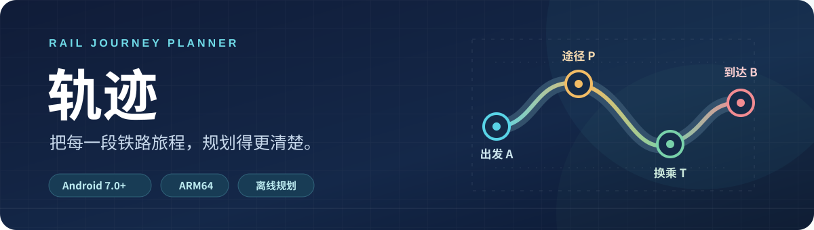
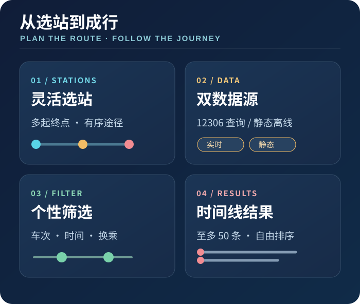
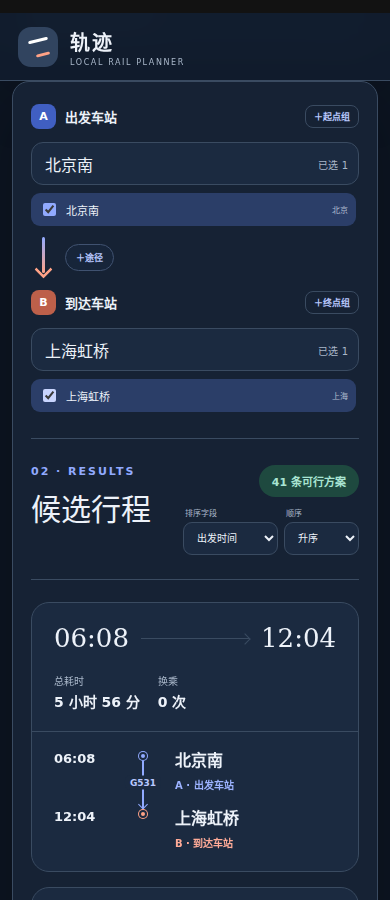

轨迹是一款铁路出行规划工具，提供 Web 页面和适用于小米澎湃 OS / Android 的应用。选择乘车日期和车站后，可以查询 12306 车次，也可以使用社区静态时刻表生成候选行程。路线计算在本地或运行 Web 服务的设备上完成。

<p align="center">
  <a href="release/ticket-plan-hyperos-arm64-v0.12.1-debug.apk"></a>
  <br>
  <a href="#版本更新">查看版本更新</a>
</p>

---

## 主要功能

<p align="center">
  
</p>

- **灵活选站**：可设置多个出发站、到达站和按顺序经过的途径站，搜索支持中文、全拼和拼音首字母。
- **两种规划方式**：联网查询所选日期的 12306 车次，或用静态时刻表规划；Android 应用内置静态数据，断网时也可使用。
- **行程筛选**：支持直达及最多 3 次换乘，可设置出发、到达时间范围、车次类型和换乘等待时间。
- **结果展示**：以时间线展示车次、经停与换乘信息；最多显示 50 条候选行程，可按出发时间、耗时或换乘次数排序。

## 界面预览

<p align="center">
  
  <br>
  <sub>页面 · 北京南 → 上海虹桥 · 静态规划</sub>
</p>


## Android 下载安装

- 当前版本：v0.12.1；[下载 APK](release/ticket-plan-hyperos-arm64-v0.12.1-debug.apk)。
- 适用设备：Android 7.0 及以上、64 位 ARM（`arm64-v8a`）手机，包括符合条件的小米澎湃 OS 设备。
- 安装方式：将 APK 下载到手机并打开。如果系统提示禁止安装，请在系统设置中允许当前文件管理器或浏览器安装未知应用。

安装包使用 Android 标准 debug 签名，适合个人侧载；后续升级需使用相同签名的安装包。APK 的 SHA-256 为：

```text
0f617f37850e084b707b4197bde736584c23f5f5f00cab8ea71fa88e19e0b760
```

校验值写在本页，`release/` 目录只存放 APK。历史版本的安装包和主要变化见下文。

## 使用说明

- **自动规划**：联网查询所选日期的 12306 车次。首次查询或路线较复杂时可能需要数分钟；可在搜索过程中查看已找到的方案并停止后续查询。结果最多显示 50 条，可按出发时间、耗时或换乘次数排序。
- **用静态数据生成**：使用应用内置或已更新的静态时刻表，无网络时也可规划。应用启动或回到前台时会尝试更新静态数据，也可在应用内手动更新；更新失败时沿用现有数据。静态时刻不代表 12306 实时车次，也不提供余票信息。
- **后台搜索**：开启“允许后台静默搜索”后，从应用内启动的自动规划可在切换到其他应用时继续运行，并通过通知提示预计完成时间及结果。Android 13 及以上需要允许通知；强制停止应用或系统终止进程后，搜索可能中断。

本应用不提供登录、购票或抢票功能。12306 网页接口可能变化或受限，实时查询也可能失败。行程与时刻仅供参考，出行前请以 12306 和车站公告为准。

---

## 版本更新

这里保留功能变化较大的版本；其余小版本未单独收录。建议日常使用最新版本。

| 版本 | 关键变化 |
| :--- | :--- |
| **v0.12.1 · 当前** | 手选站优先查询、改号别名补全 |
| v0.12.0 | 同车改号识别、手选枢纽保底 |
| v0.11.0 | 完整行程优先核验 |
| v0.10.1 | A / P / B 多组站点 |
| v0.9.0 | 渐进显示结果、随时停止 |
| v0.8.0 | 后台搜索、耗时预估 |
| v0.7.5 | 途径核验、候选站评分 |

### [v0.12.1](release/ticket-plan-hyperos-arm64-v0.12.1-debug.apk)（当前版本）

- 手动选择的换乘站优先查询，然后再查询静态时刻表推荐的候选站，让用户指定的路线更早得到结果。
- 除 12306 内部列车编号外，还能利用静态时刻表明确记录的别名识别途中改号的同一列车，避免将其误算为换乘。

<details>
<summary><strong>展开历史版本的详细更新</strong></summary>

### [v0.12.0](release/ticket-plan-hyperos-arm64-v0.12.0-debug.apk)

- 将 12306 返回的同一物理列车的不同公开车次号合并为一段行程，不再因运行中改号增加换乘次数。
- 用户手动选择的换乘站会保留在最终至多 5 个候选站中，不再被自动推荐挤出。

### [v0.11.0](release/ticket-plan-hyperos-arm64-v0.11.0-debug.apk)

- 实时规划先根据静态时刻表形成完整候选行程，按方案顺序核验所需车次，减少较优方案等待完整车次详情的时间。
- 核验完静态候选后仍继续查询其他实际车次，补充静态时刻表未覆盖的方案。

### [v0.10.1](release/ticket-plan-hyperos-arm64-v0.10.1-debug.apk)

- 行程选择器使用独立的出发组 A、途径组 P、到达组 B；途径站按顺序经过，站点分组更清晰。
- 出发和到达两侧都可添加多个车站组，规划时要求每组至少命中一个车站；同侧各组不限定先后顺序。

### [v0.9.0](release/ticket-plan-hyperos-arm64-v0.9.0-debug.apk)

- 实时规划改为渐进显示：查询过程中持续更新已找到的较优方案，无需等全部车次查完。
- 增加“停止搜索”，停止后保留已找到的方案，便于在查询较久时先查看结果。

### [v0.8.0](release/ticket-plan-hyperos-arm64-v0.8.0-debug.apk)

- 增加首次实时查询的预计耗时和已搜索时间提示。
- Android 端增加可选的后台搜索与完成通知，切换到其他应用后仍可继续查询。

### [v0.7.5](release/ticket-plan-hyperos-arm64-v0.7.5-debug.apk)

- 完善多站点及途径点规划：途径站在候选行程生成后按实际经停顺序核验。
- 将静态推荐、手选换乘站和途径站合并评分，选择至多 5 个候选站进行实时换乘查询。

</details>

---

## 数据来源与致谢

- [中国铁路 12306](https://www.12306.cn/)：公开车次查询页面。
- [wensimehrp/chinese-railway-gtfs](https://github.com/wensimehrp/chinese-railway-gtfs)：社区静态时刻数据。
- [pypinyin](https://github.com/mozillazg/python-pinyin)：城市与车站拼音搜索。
- [Chaquopy](https://chaquo.com/chaquopy/)：在 Android 应用中运行规划所需的 Python 代码。

## 声明

轨迹是独立开发的非官方工具，与中国铁路 12306 不存在隶属、授权或合作关系。
